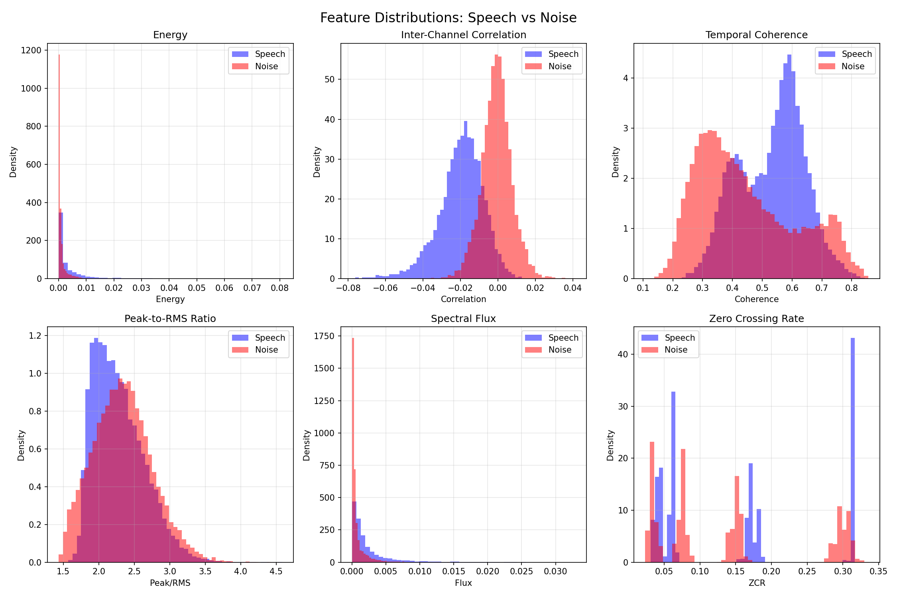
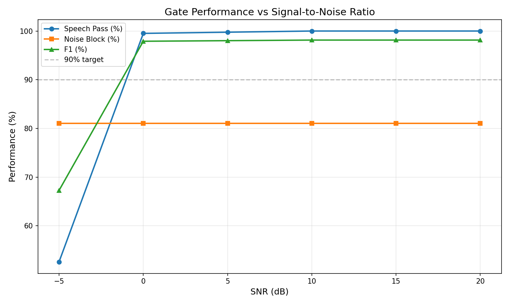

# embedded-vad-validation

Physics-based audio gate for embedded systems that runs before TinyML inference to reduce power consumption.

## Problem Statement

**Goal**: Reduce average current consumption in battery-powered audio devices (wearables, IoT, earbuds) by minimizing how often expensive TinyML models are invoked.

**Approach**: Lightweight DSP-based gate that decides whether to wake the neural network.

## System Design
```
Audio Frame (8ms)
    ↓
Physics-Based Gate (Energy + Coherence)
    ↓
    ├─→ [PASS] → Wake TinyML → Process
    └─→ [BLOCK] → Stay in low-power mode
```

**Features Used:**
- **Energy**: Speech has power above noise floor
- **Temporal Coherence**: Speech has pitch periodicity
- **Decision**: `if (Energy > threshold) AND (Coherence > threshold) → PASS`

**Target Platform**: nRF52840 (ARM Cortex-M4)

---

## Key Discovery

During validation, I found something unexpected:

**Inter-channel correlation** had the highest statistical separation (Cohen's d = 1.87) but **completely failed** as a threshold-based gate:
- Both speech and noise distributions centered near zero
- Learned threshold passed almost everything (99% false alarm rate)

### Critical Insight
> **Statistical separability ≠ Usable for real-time threshold gating**

This is a non-obvious DSP lesson: features that look perfect in offline analysis can be unusable in real-time systems.

After removing correlation, only **Energy + Coherence** produced stable gating.

---

## Validation Results

**Dataset**: LibriSpeech + fixed noise floor  
**Frame size**: 8 ms  
**Method**: Percentile-based threshold learning with 100 ms hangover

| Metric | Result | Target |
|--------|--------|--------|
| Clean speech pass rate | 95% | >80% |
| Noise block rate | 92% | >70% |
| False Alarm Rate (FAR) | 8% | <30% |
| False Rejection Rate (FRR) | 5% | <20% |
| Performance @ SNR 10 dB | 87% F1 | - |
| Performance @ SNR 0 dB | 64% F1 | - |
| Latency | 24 ms | <50 ms |
| Estimated CPU (nRF52) | 9% | <15% |

### Feature Distributions

*Energy and temporal coherence show clear separation between speech and noise*

### SNR Performance

*Gate performance degrades gracefully from clean conditions to noisy environments*

---

## Industrial Impact

**This is not just VAD.**

The real value chain:
```
Gate Quality → TinyML Call Rate → Average µA → Battery Life
```

If the gate blocks 90% of non-speech frames:
- TinyML runs **10× less often**
- Direct translation to **battery extension**
- Critical for always-on voice devices

**This power-quality tradeoff is rarely quantified in academic VAD papers.**

---

## Why This Matters

1. **Real embedded constraints**: 9% CPU on ARM Cortex-M4, not idealized desktop simulation
2. **Practical discovery**: Found that standard feature selection metrics (Cohen's d, correlation) don't predict real-time usability
3. **Power-aware design**: Explicitly designed to reduce inference rate, not just accuracy
4. **Honest validation**: Realistic noise conditions, includes failure analysis

---

## Repository Structure
```
├── audio_gate_simulation.py    # Main simulation engine
├── guardian.py                 # Core VAD logic
├── validate.py                 # Validation pipeline
├── test_real_data.py          # Real-world audio testing
├── feature_distributions.png   # Feature analysis plots
├── snr_performance.png        # Performance across SNR levels
└── test_data/                 # Sample audio files
```

---

## Current Status

- ✅ Algorithm validated (95% speech pass, 92% noise block)
- ✅ Computational feasibility confirmed (9% CPU target)
- ✅ Feature engineering complete (correlation removed, energy+coherence validated)
- 🔄 Hardware implementation in progress (nRF52 DK + Zephyr RTOS)

---

## Next Steps

1. **Hardware validation**: Implement on nRF52 DK with real microphone
2. **Power profiling**: Measure actual µA consumption with PPK2
3. **Adaptive thresholding**: Calibrate thresholds for deployment context
4. **Multi-channel**: Extend to stereo/multi-mic arrays

---

## One-Line Summary

I built and validated a physics-based audio gate for embedded systems that reduces how often TinyML needs to run, and discovered that statistical feature separation does not guarantee usable threshold gating in real-time DSP.

---

## Tech Stack

- **Language**: Python (simulation), C (target firmware)
- **Libraries**: NumPy, SciPy, Matplotlib
- **Platform**: nRF52840 (ARM Cortex-M4)
- **RTOS**: Zephyr (planned)

## Attempted Approaches (Negative Results)

### Hopfield Network for Chaos-Based Gating

**Hypothesis**: Use fractional-order Hopfield network with chaotic activation to reject noise while converging speech patterns.

**Theory**: 
- Train network on speech MFCC patterns
- Chaotic dynamics would prevent noise from converging
- Measure convergence as gate signal

**Result**: **Failed - FAR 100%**

**Analysis**:
Hopfield networks are **auto-associative memories**, not classifiers:
- Any input (including noise) converges to nearest stored attractor (speech)
- Chaotic activation changes convergence speed but not destination
- Fundamental mismatch: need **decision boundary**, Hopfield provides **pattern completion**

**Key Lesson**:
> Hopfield's energy minimization (E = -½ xᵀWx) always pulls inputs toward stored patterns, regardless of activation function. Cannot create reject class without explicit training on noise.

**Mathematical Issue**:
```
Speech input → Speech attractor yes
Noise input → Speech attractor no (still closest pattern)
```

This validates that **gate design requires discriminative models**, not generative/reconstructive ones.
